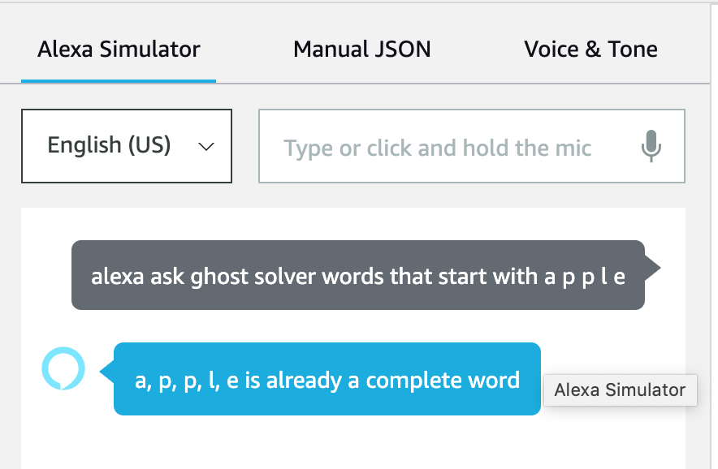

# Alexa Ghost Solver

I built an Alexa Custom Skill to solve a game called Ghost that my family would play during car rides when I was a kid. In the game, you take turns saying letters to form a word. However, you don't want to finish a word that has more than 3 letters. So for example, going in a circle, the letters could be 'a' - 'p' - 'p' - 'l', and the next person wouldn't want to say 'e' to finish 'apple', so instead could say something like 'a' which could make 'applaud'. If you finish a word you get an 'out' and people can challenge your letters if they don't believe a word exists.

The skill is called Ghost Solver and can be launched by saying "Alexa, open Ghost Solver". Alternatively, you can launch the skill and trigger an intent in the same line via "Alexa, ask Ghost Solver ...". Here are some sample questions and responses:

---

This repo only contains the code for Intent Request Handler in the code for my skill's enpdoint and the Trie. The model building is done through an interface in Alexa Developer Console, where you speciify invocation names, create Intents, give sample utterances, define slots, etc.

Overrall, the skill works very well and I learned the basics of developing Alexa Skills which opens up doors for projects that would explore more complex operations. The one problem I have is building the Trie. In my own python env where I coded and tested the Trie, building the Trie from my dictionary file of ~235,000 words took 5-10 seconds. Then lookup was obviously basically instant. In the real endpoint for my skill (which is also deployed in Alexa dev console), the trie is built upon launching of the skill. However, for some reason there the building of the Trie caused a timeout. I fixed this by only including the first ~80,000 words and removing the rest of the dictionary file (so don't ask about words after 'f'!). From my understanding, hosting an endpoint through AWS and linking it to your skill rather than the using what they call the built in "Alexa endpoint" which you can modify and deploy right in the skills console gives you more flexibility and computation power, which could solve this problem.
